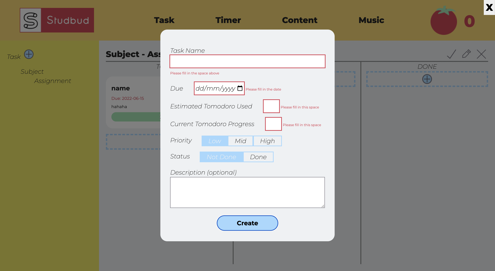

# STUDBUD
.png)

## Description
STUDBUD is web based application that will help student manage their assignment task coming with varies of tools such as task management, time management, content management, and music player.

## About
This website is only a web prototype made by one of the university student and only be used for an educational purpose. The web prototype is not fully functional, which mean the website will be running only on local host via the used of npm dev tool. Since this is only a part for university project at USYD - DECO2017 Advanced Web Design course given by the task:

> Design and prototype a web application to help people manage their study sessions. DesCo has identified a gap in the market for a platform which focusses on managing individual study sessions. 
This web-based application should combine planning and content functionality, to equip students with the tools 
they need for a productive study session.

## Goal and requirements
To create a study tool that help student complete their assignment task. There are certain features that we need in our website such as:
 * Task management: user able to manage their assignment status and divide it to small task list, which they can manage those small task using Kanban board)
 * Time management: user able to track their progress of each task using our timer tool to encourage them to study)
 * Content management: user able to manage their resource by adding link to relavant subject)
 * Music player: study also need relax tool!

 ## Note for developer
 Our server use Node.js and express and parcel to sending information and handle localhost at Node 1234 (for npm dev tool)

 This web application only contains 4 HTML file (where each file will handle 4 different tools)

 The Scss had been used to styling each of the section of the page. Where the main styling such as body layout, and header layout will be in layout.scss and the general typography of the whole page will be in typography. Special layout, style, and typography for each tools will be handle in components folder. All the scss will then get import to single main.scss file which will be included in every HTML page

 All the art in the web page had been done and design by me

 Each tools also have their own different functionality, so they will have its own javascript file in js folder

 CustomElement tag had been used in some of the HTML page to make the  webpage looks more semantic by reduce the use case of ```<div>``` tag. All the custom element had been declare on javascript file named customElementinit.js where this script will be included in every HTML page.

 The ```<body>``` will only contains 2 visible content which is ```<header>``` and ```<main>``` other than that will be acts as a template for adding dynamics contents or ```<popup-form>```

 ```<popup-form>``` tag will used to contain popup form that will shown up when the website need to ask for input from the user. This tag will be hidden, and shown up only when user need it. So, user don't need to go out to different page to fill up the form.

 Any of user input will be kept in local storage and will used to display the page differently

 ## Project status
This web application will only handled on local host, the user input will be kept in local storage so whenever user come back to the page it's still save the progress. Currently developing drag button, and mobile version.

## Contributor
USYD: https://www.sydney.edu.au/

## Credit
Programmer: Best Phanuwish

# Features

## Task Management


This is what the user will see when they first land in on the website. The big button on the page will encourage user to try the feature add assignment. Which is the most important thing to do when user land in the page, otherwise they won't be able to use timer and content tool if they doesn't add any assignment yet.


After user add an assignment to the page. The main content will turns to Kanban board, and it will add new assignment to the aside navigation. If the assignment had the same subject, it will add at the same subject category. User also able to mark assignment as done, edit an assignment or delete an assignment. Which will remove date from user's local storage.


Kanban board allow user to be able to add task in any different section, where each task will show its data accorded to user's input. User also able to drag task note between different section, or edit a task, or delete a task. The task will be automatically ordered accorded to due date and priority. If the task has mark as done, it will automatically moved to done section and filled the progress bar.

## Time management


This is the page where user will working on their task. The user able to select between Pomodoro timer or Stopwatch timer up to their preference. (Note that if user need to use Pomodoro timer, they will need to have at least 1 task from task page before they able to start the timer)


With the Pomodoro technique, this will help student focus on the task in a period of time and have a proper break time, from the research by doing this will increase student works efficiency. The user have to select a task from their task list, then the Pomodoro timer can start and it's time for them to change on different page and do the work. After the time is up, the user also got 1 Tomato as a reward and take a break. This will keep student motivated on doing their task.


The user also able to adjust the timer on whatever they like through the setting icon. Where they able to adjust the time on each period and the long break interval where it will come every 4 Pomodoro.


The user also able to select stopwatch timer mode. Where the timer will go up when user start it. Reset button will set everything back to default (also work on Pomodoro timer)

## Content management


After user add a subject on task page. They also able to add a reference link as a resource to each subject that they have.


When adding a new content, user able to add as many link as they wish to its content note.


User also able to edit any information on the note, or delete any link. Or even delete the note itself, on the content page.

## Music player


On music page, user able to paste the YouTube URL and it will embed for user to be able to listen to it. 


When the user paste YouTube link and submit it, it will check if it's valid, then it will go through the link and cut then get the infornation on JSON link object to display the name and thumbnail picture.


The embed process and check if it's YouTube link has been done by very complicated process. Which I will be credited for the research that I've found on the section of the code and annotation.

With the use of custom YouTube embed object. User able to play/pause change the volumn, and skip to specific part of the song, which is very powerful than what I first imagined.


The user also able to add as many song as they wish, and it will display it on the song list where user able to select any song they want to listen to. User also able to skip thorugh any song by using the skip button.

# Design Principles and Patterns

Making people understand what your website is about and take an action is the main goal when designing the website. Create website following by design principles and patterns will help user experience throught the website.

## Information Architecture

This web application only contains 4 different tools of the website. With the use of sticky header which will included on every HTML page, this will help user navigate to each different tools that suits its purpose and easy to navigate.

The aside navigation also helpful when user will manage their task in the future where they have too many assignment to handle, and it help them organise their information accorded to their subject.

## Design Patterns
As you can see on the website, with the used of scss and its variable declaration, we able to build a website with consistant layout, color pallete and typography throughout the whole web application.

## Popup Form

The  ```<popup-form>``` had been used consistantly. The way it protray on the web page is well done and powerful. The user don't need to leave their page to fill the form with this tag. User able to fill in the input and submit it and passing information down using Javascript. The dim background also allow user to exit the form to help ace the convenient this popup form can provided.

## Form Custom Validation

Most of the website not rely on default form validation because of its inconsistancy in design. So, I also decided to used custom form validation. That came with lot of benefits such as, the design is suits to overall looks of the website, it specify in detail on which input the user had missed, and ability to custom the warning text to tell the user what they've done wrong. 

# References
1. DECO2017_DesignBrief. (2022). Retrieved from https://canvas.sydney.edu.au/courses/39757/files/22265699